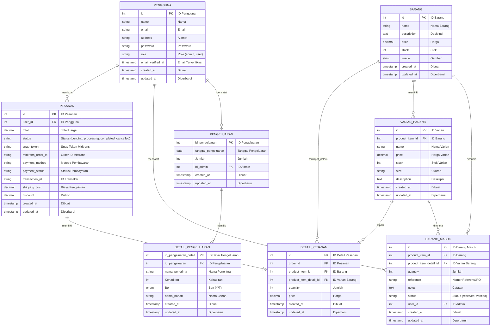

# Diagram Database - Sistem Manajemen Mebel

## ER Diagram (Mermaid Syntax)

## Penjelasan Relasi

### Tabel Utama:

1. **PENGGUNA** (users)
   - Penyimpanan data pengguna sistem
   - Memiliki role (admin/user)
   - Relasi dengan pesanan, barang masuk, dan pengeluaran

2. **PESANAN** (orders)
   - Menyimpan data pesanan dari pengguna
   - Terhubung ke detail pesanan (item-item dalam pesanan)
   - Memiliki status pembayaran (pending, processing, completed, cancelled)
   - Terintegrasi dengan Midtrans untuk pembayaran

3. **DETAIL_PESANAN** (order items)
   - Setiap baris adalah 1 item dalam pesanan
   - Terhubung ke barang dan varian barang
   - Menyimpan harga saat pembelian (historical)

4. **BARANG** (products)
   - Master data produk/barang
   - Memiliki berbagai varian (ukuran, tipe)
   - Menyimpan stok utama

5. **VARIAN_BARANG** (product variants)
   - Detail varian dari setiap barang (size, tipe)
   - Setiap varian memiliki stok sendiri
   - Bisa memiliki harga berbeda

6. **BARANG_MASUK** (stock in)
   - Mencatat semua barang yang masuk ke gudang
   - Terhubung ke barang dan variannya
   - Dicatat oleh admin (user)

7. **PENGELUARAN** (expenses)
   - Mencatat pengeluaran kas/biaya operasional
   - Dicatat oleh admin
   - Dapat memiliki multiple detail pengeluaran

8. **DETAIL_PENGELUARAN** (expense details)
   - Detail item dalam satu pengeluaran
   - Menyimpan informasi penerima, kehadiran, bon

## Cardinality (Relasi):

- **One-to-Many (1:N)**:
  - PENGGUNA → PESANAN
  - PESANAN → DETAIL_PESANAN
  - BARANG → VARIAN_BARANG
  - BARANG → BARANG_MASUK
  - PENGELUARAN → DETAIL_PENGELUARAN

- **Many-to-Many (N:N)** via junction table:
  - PESANAN ↔ BARANG (via DETAIL_PESANAN)

## Constraints:

- Foreign keys dengan CASCADE delete untuk menjaga integritas data
- Timestamps (created_at, updated_at) untuk audit trail
- Status enums untuk kontrol nilai yang diperbolehkan
- Price menggunakan DECIMAL untuk akurasi financial data
